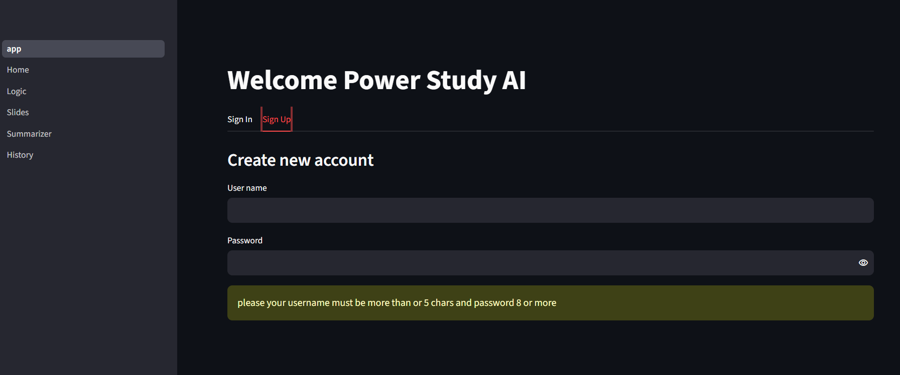
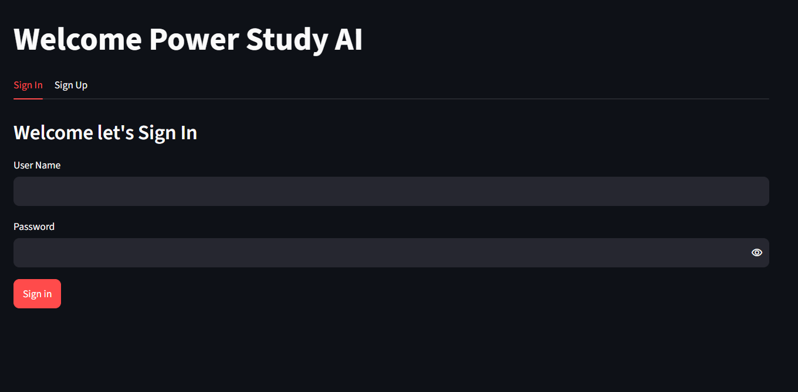
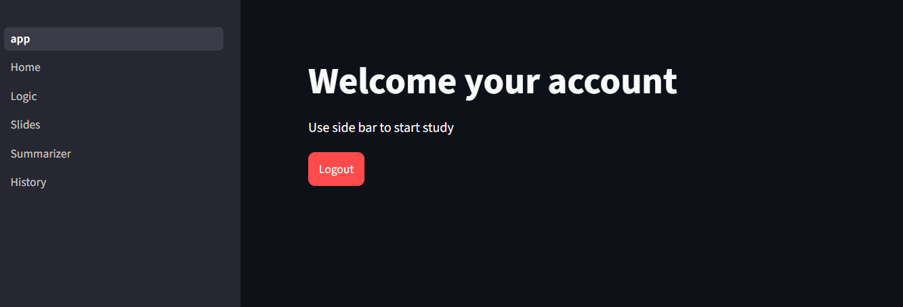
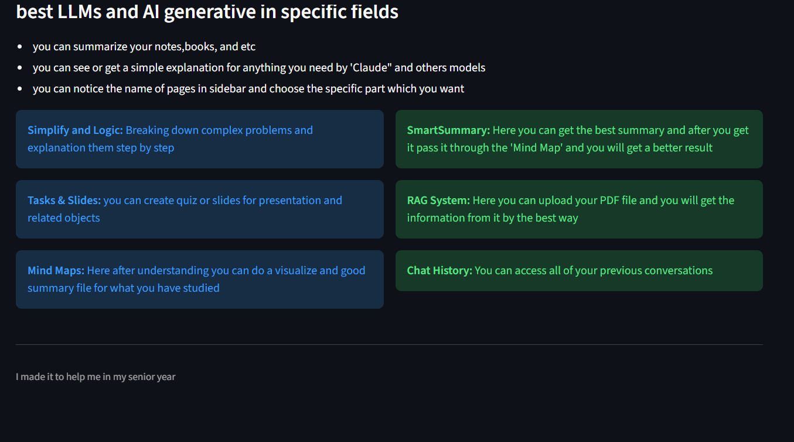
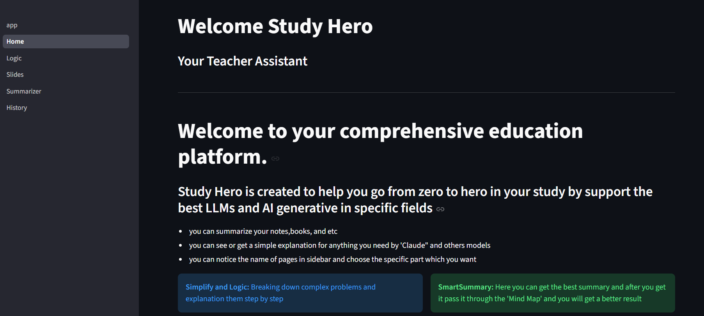
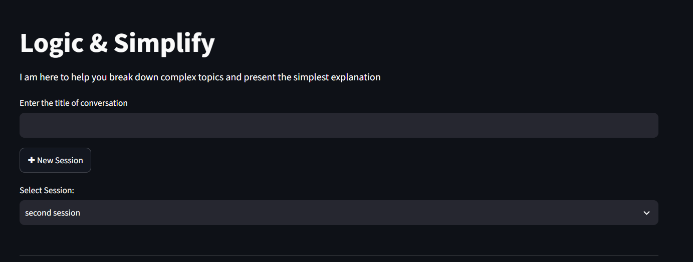
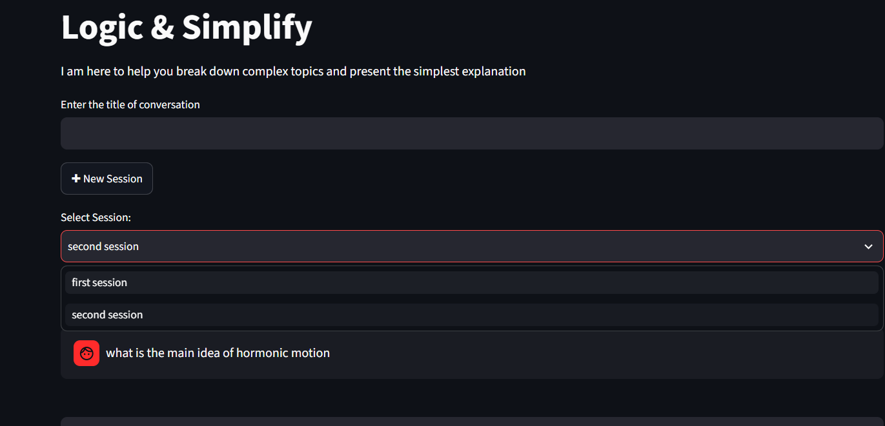
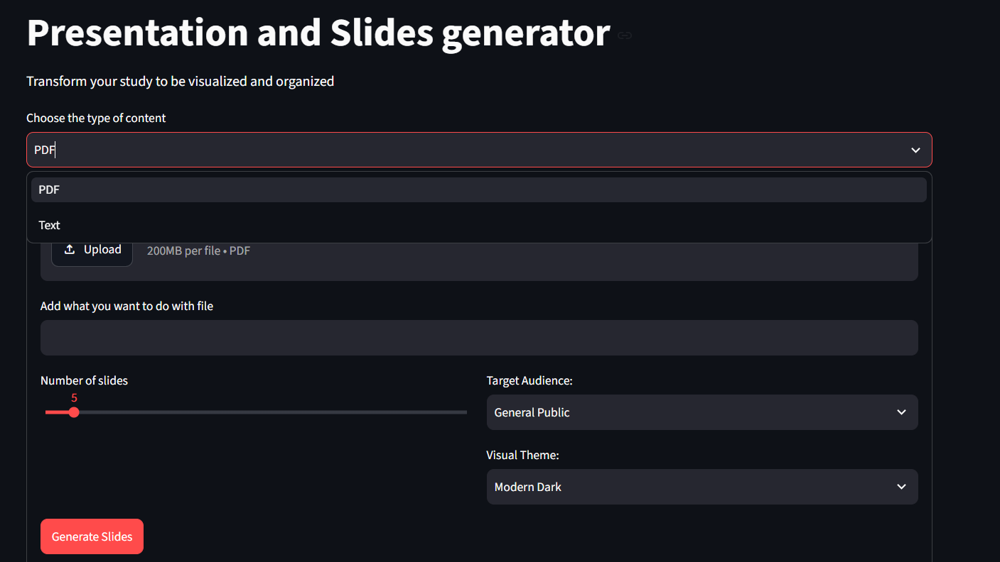
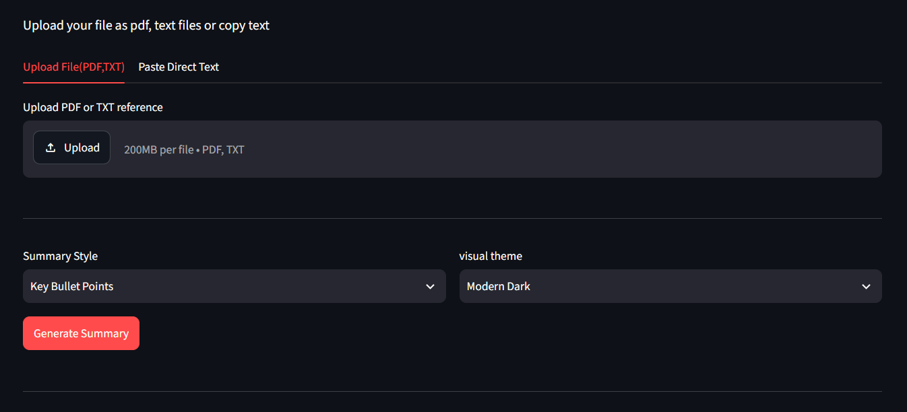

## Hero Of High School

### Content

- This project consist of 6 pages
- first one is a simple way to sign up on this website this is not a real authentication but just to connect and save your history on the data base
- second page is the home tells you overview about the website
- third page is the logic page and you can use it if there is a hard topic you can't understand it this page connect to claude model and this is the best model to break down hard and complex topics and this is only page connect to the database
- fourth page slides page , if you want to do a good slides by html and css design you can use this page 
- fifth page is similar to the fourth but it is connected to gemini 2.5 pro which has large context window can summarize large pdf and text files
- sixth page it is a history it is similar to logic but without using all previous state or information of you conversation but everything saved in the database

# How it works

### first page
- you should sign up firstly
---

- then sign in
---

- if you want to logout and do new username with new database you can do by logout
---

### second page

- in this page you can get enough information about the website

### third page

- you have a place to call your conversation and then click add "new session"
---

---
- if you have more than conversation you can choose anyone as you like 

---

### fourth page

- you have two choices to upload the type of your file "pdf" or "text", you can choose the theme or audience as well.

---

### fifth page

- you have 2 tabs one for paste your content and another to upload file

### the last page
- is the history and it looks like the logic page

### Why i did that

- this is the first generation or beginning of that project there are more features can i add but this is enough now to test it

- iam in my last year in high school and i wanted to get the most effecient so i used free API models of hackclub to do this project to help me generate best slides and explanation for me 

### AI decleration
- I have used just AI in generating good system prompts for Large language model and help me to give me the commands of deploy that project on nest
- And last 20 mins coding the ai helped me to solve some errors

## Power Builded in API (AI models of hack club)
- I have used that to improve my studies ways by using AI which i have built it and control memory and everything by myself
